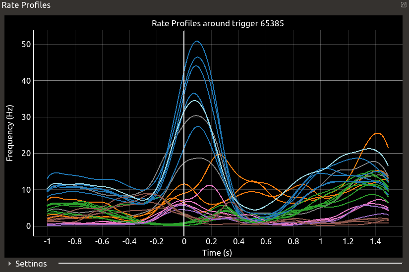
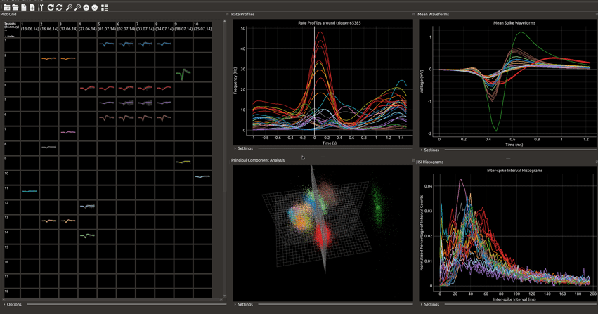

SWAN
====


**SWAN** (Sequential Waveform Analyzer) is an open-source graphical tool being developed at the [Institute of Neuroscience and Medicine - 6 (INM-6)](http://www.fz-juelich.de/inm/inm-6/EN/Home/home_node_INM6.html) of the Forschungszentrum Jülich, for tracking single units across multiple sessions of electrophysiological data that was recorded using chronically implanted microelectrode arrays. The tool is written in Python 3 and [PyQt5](http://pyqt.sourceforge.net/Docs/PyQt5/), and makes use of efficient libraries for plotting ([pyqtgraph](http://www.pyqtgraph.org/)), number crunching ([numpy](http://www.numpy.org/)), data I/O and storage ([pickle](https://docs.python.org/3/library/pickle.html), [neo](https://neo.readthedocs.io/en/latest/)). The Graphical User Interface (GUI) is modularly organized into multiple views, each showing a different aspect of the loaded datasets.

The tool is currently used to analyze [reach-to-grasp datasets](https://web.gin.g-node.org/INT/multielectrode_grasp) which were recorded using the [Utah Microelectrode Array](https://www.blackrockmicro.com/electrode-types/utah-array/). Thus, in its current state, it works with datasets stored in the proprietary `.nev` and `.ns6` file formats provided by Blackrock Microsystems. However, the tool makes use of `neo`'s file I/O capabilities and data storage structures, making it easy to extend its functionality to datasets recorded using other systems.

## Table of Contents

- [Purpose and Aim](#Purpose-and-Aim)
- [Compatible datasets](#Compatible-Datasets)
- [Installation](#Installation)
- [Getting Started](#Getting-Started)
    - [Creating a new project](#Creating-a-new-project)
    - [Saving a project](#Saving-a-project)
    - [Loading a saved project](#Loading-a-saved-project)
    - [Interface](#Interface)
    - [Selecting units](#Selecting-units)
    - [Swapping units](#Swapping-units)
    - [Autmatic algorithm](#Automatic-algorithms)
    - [Exporting results](#Exporting-results)
- [Contributing](#Contributing)

## Purpose and Aim

In extracellular electrophysiological experiments, the population activity of neurons is obtained in the form of time-ordered voltage measurements recorded using probes inserted into brain tissue. From this population activity, the activity of putative single neurons (or, _single units_) can be isolated by the process of [spike sorting](http://www.scholarpedia.org/article/Spike_sorting). 

In chronic electrophysiolgical experiments recorded using microelectrode arrays, the implanted electrodes of the array remain in a fixed position over long periods of time, enabling the long-term measurement of the population of neurons surrounding the electrodes in the brain tissue. Typically, each experimental session is spike sorted independently, resulting in a large number of single units over the course of the experiment. However, given that the electrodes are recording chronically from the same population of neurons, one might expect many of these seemingly independent single units to arise from the activity of the same neuron in different experimental sessions.

A single unit consists of the time stamps when the unit fired, termed the _spike times_, and the corresponding snippets of the voltage signal showing the characteristic response of the neuron, termed the _waveforms_. Together, these can be used to compare and identify single units which might correspond to the same neuron. This is also where SWAN gets its name from - it helps with the sequential analysis of spike waveforms.

SWAN is designed to help you identify such single units across multiple spike sorted datasets. It extracts different features of neurons across datasets -- namely, the mean waveform of the single unit, the inter-spike interval histogram of the corresponding spike train, and the event-triggered rate profiles -- and displays them in an intuitive fashion. It then allows the user to assign _global unit IDs_ (GIDs) to each single unit so that all units that putatively arise from the same neuron can be identified by on GID.

## Compatible Datasets

SWAN currently works with `.nev` files recorded using equipment from Blackrock Microsystems. The spike sorting results of all desired sessions must be stored in separate `.nev` files, with each file containing the time stamps and waveforms of each single unit. Each data file is read in using the BlackrockIO class of Neo, thus, preserving any existing names or description given to units during the process of spike sorting. 

In the current implementation, all units with the words "noise" or "unclassifed" in the description are not loaded and are excluded from the analysis. Depending on different use cases, this could be modified in future releases.

## Installation

SWAN is currently not available on either conda or PyPI, and must be installed from the source. A PyPI package is in the works.

We recommend installing SWAN in a conda or virtualenv environment. The installation itself is carried out from the source directory using pip.

### Using Conda

```shell
conda create -n swan python=3
conda activate swan
pip install python-swan
```

### Using Python Virtualenv

```shell
virtualenv venv
source activate venv/bin/activate
pip install python-swan
```

## Getting Started

Once installed, start SWAN using

```shell script
swan /path/to/temp/
```

where `/path/to/temp/` is where you want store cache files generated while using SWAN. When no argument is provided, it defaults to the output of `tempfile.gettempdir()` from the [tempfile](https://docs.python.org/3/library/tempfile.html#tempfile.gettempdir) package. **Note:** on a Windows machine, the path argument should look something like `C:\path\to\temp`.

### Creating a new project

To begin using SWAN, click on `File -> New Project...` or click on the "New Project" icon . This will open the following dialog.


Use the "Browse..." button to choose the path of folder where your data files are stored. All loadable files will be shown in the list on the left by their filenames (without the extension). Select the ones you wish to load and click "Add" to move them to the list on the right. Data files from multiple locations can be loaded using this method. Once all required files have been selected, click on "OK" to load all datasets. By default, the first channel of all selected datasets will be loaded. A temporary project file will be created in the temporary directory specified when launching SWAN.

### Saving a project

At any point in time, you can save any changes you have made to a project by clicking `File -> Save Project As...` or clicking the icon  in the toolbar and choosing a location and name to save the project file. In case you want save over the current project file, click on `File -> Save Project` or the icon  in the toolbar.

### Loading a saved project

If you wish to continue working on a previously saved project, click on `File -> Load Project...` or the icon  in the toolbar, and choose the `.txt` file which corresponds to your desired project file. Keep in mind that the corresponding `.vum` must also exist in the same location as the `.txt`. file.


### Interface

The interface of SWAN is organized into five dockable widgets, called _views_, each showing a specific aspect of the loaded data.

1. Plot Grid - This is the primary view of SWAN, showing an overview of all single units being analyzed. Once all desired datasets have been loaded, this view displays a grid of cells wherein each column corresponds to a loaded dataset (_session_) and each row corresponds to a GID, with each GID corresponding to a unique colour. This GID and colour are shared across all views in SWAN. Each single unit found on a given session is assigned a GID and the unit's mean waveform is plotted in the cell using the corresponding colour. Each cell, row or column in the grid can be selected and deselected. Additionally, a whole row or column can be deactivated (and also reactivated) by clicking the first cell of that row or column, respectively. Single units housed in deactivated cells are not displayed in any other view.
 


2. Mean Waveforms View - This view shows the mean waveforms of all single units active in the Plot Grid, overlayed on top of each other. The colour of each unit corresponds to the colours used in the Plot Grid. The shape of the waveform for a given neuron is expected to remain constant over long periods of time. By comparing the mean waveforms of various single units in this view, similar units can be identified. 


3. Inter-spike Interval Histograms (ISI Histograms) View - The inter-spike interval histogram of the spike train corresponding to a single unit is a distribution of the time intervals between consecutive spike times, and is often used to characterize the firing activity of units. The ISI Histograms View shows the ISI histograms for all single units active in the Plot Grid. Just like the waveform shape, the firing activity of neurons in the form of ISI histograms is expected to remain consisted across different experimental sessions. Units with similar ISI histograms are likely to correspond to the same neuron. 
 
 

4. Principal Component Analysis View - Principal Component Analysis (PCA) is used to reduce the dimensionality of the waveforms corresponding to each active single unit in the Plot Grid. The first three principal components (PCs) for each waveform are plotted in this view in a 3-dimensional scatter plot, with the mean waveform of each unit shown by a large cube. The colour of each cluster of waveforms corresponds to the GID of the unit. Clusters which are close together in the PC-space correspond to units with similar waveform shapes, and could represent the same neuron.
 


5. Rate Profiles View - This view relies on the availability of experimental events in the datasets. The instantaneous firing rate of each active single unit around a chosen event trigger, averaged across experimental trials, is plotted in this view. These rate profiles are used to relate the firing activity of neurons with the behaviour of the animal and the rate profiles of a given neuron around relevant experimental triggers can be expected to remain similar, even across multiple experimental sessions. The colours, again, correspond to the GIDs of the units.



### Selecting units

To determine which curve/point in the different views correspond to which unit in the Plot Grid, you can click on either the cell of the unit or on any of the curves (in the Mean Waveforms View, ISI Histograms View, Rate Profiles View) or the point corresponding to the mean waveform in the PCA View. This will highlight the curves/points corresponding to that unit across all views. Clicking again will remove the highlight. This can be used to highlight units across all views.



### Swapping units

The most fundamental functionality of SWAN lies in its ability to reassign GIDs to the single units shown in the Plot Grid. This is achieved by swapping the contents of two cells in the grid. After selecting one cell in a certain column, a second cell in the same column can be selected. Once two cells are selected, the contents of the cell can be swapped by clicking on the `Edit -> Swap` or the icon  in the toolbar. If both cells contain a unit, then the GIDs of the units are swapped (along with their colours). If one of the cells is empty, then the unit contained in the other cell is assigned to the empty cell, thereby assigning it a new GID.

This process can be repeated until the desired mapping of the original units to the GIDs is achieved. The goal is to assign one GID to all units which putatively represent the same neuron.


### Activating and deactivating rows and columns

At some point while using SWAN, you might encounter the need to "turn off" certain global unit IDs (rows), or certain sessions (columns), so as to be able to visualize specific units better. This is possible by clicking the first cell in the row or column which needs to be deactivated. This will grey out that row/column, and all single units on that row or column will no longer be visible in any of the other views. To re-activate the row/column, click the first cell in the row/column again.

Note: the PCA view uses the session with the largest number of units to calculate the principal components. By deactivating certain units, you might change the session chosen to calculate these principal components and the PCA view may not remain the same.


### Automatic algorithms

Although manually swapping units is a simple and intuitive way of arriving at the final mapping of units to GIDs, it can get tedious and time consuming when a large number of sessions are loaded. We provide the possibility of automatizing this process with the help of algorithms. Two algorithms have been implemented, accessible by clicking `Edit -> Recalculate Mapping...`. A dialog appears giving a choice between the following two algorithms.
 
 1. Euclidean-distance based waveform comparison (Old Implementation) - the Euclidean distance between the mean waveforms of all units of each pair of consecutive sessions is calculated, and those units with highly similar waveforms are assigned the same GID. This process is repeated for each pair of consecutive sessions. This method is provided for as legacy, however, it is no longer maintained.
 
 2. K-means++ clustering in high-dimentional feature space (SWAN Implementation)- a customizable set of features is used to build a feature vector for each unit. Then these units are clustered in a high-dimensional feature space using the K-means++ algorithm. Before the clustering, the expected number of clusters must be provided as input for the clustering algorithm. Since it is not possible to assign the same GID to two units from the same session, the algorithm resolves such conflicts after the clustering step by assigning fresh GIDs to conflicting units. This is the recommended algorithm for SWAN.
 
    - Cluster Splitting - the clustering step in the algorithm does not take into consideration the date and time of the session on which a certain unit was found. This could lead to a scenario where units with similar firing characteristics but with a huge gap in the time of recording may be clustered together. To avoid this, the user can enforce a certain threshold on the time interval between two units (in days). Any cluster with units violating this threshold will be split.
  

### Exporting results

Once the final mapping of units to GIDs is obtained, it can be exported to either a CSV format, or an OdML format. Both these options can be found under the `File` menu.

## Contributing

Please feel free to file any bug reports or submit pull requests for SWAN. We're also happy to hear about suggestions and feature requests.

## Authors

SWAN is currently being maintained by [Shashwat Sridhar](https://github.com/shashwatsridhar). The original version of SWAN was developed by Christoph Gollan. 