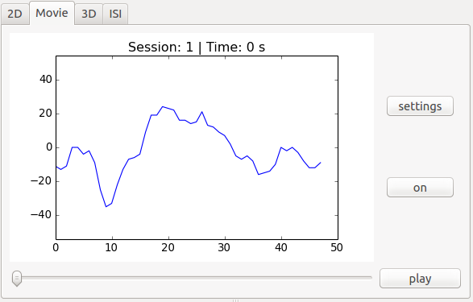

Tutorials
=========

Here you can find tutorials for swan. 

You can see how to create a new project, load a project, how the
project files look like and so on.

Of course you can learn how to use swan's tool bar functions as well.

|

Projects
--------

Create a new project
^^^^^^^^^^^^^^^^^^^^

To create a new project you have to click on *File->New Project* or on the folder icon with
the little plus on it.

A dialog will open where you can choose a directory containing ".nev" files.

Just click on *browse...* and confirm the directory by clicking on *Open*.

You will now see a list of files on the left of the dialog.

Choose the files you want to load. "Ctrl-Click" and "Shift-Click" for multiple file selection
are supported.

By clicking on *Add* the files will be added to the right list. These are the files that will be
loaded.

If you want to add another file(s), you can just choose them and click *Add* again.

If you want to remove files from the right list, just select them and click *Remove*.

Now that you have your files selected, click on *Ok* and the project will be created.

The files will be loaded directly after that.

|
|
|

Load a project
^^^^^^^^^^^^^^

To load a project click on *File->Load Project* or on the folder icon with 
the little pencil on it and choose the project file.

Now click on *Open* and the project will be loaded.

|
|
|
|
|
|
|
|

Overview
--------

Swapping units
^^^^^^^^^^^^^^

To swap units you have to click on *Edit->Swap* or on the swap icon.

Swapping is only allowed if you have two units selected which both are in the same
session. Otherwise nothing will happen. 

To select units just click on them.

|
|
|
|
|
|
|
|
|
|
|
|
|

.. _Resizing-and-Zooming:

Resizing and Zooming
^^^^^^^^^^^^^^^^^^^^

You can change the size of the overview plots by clicking on the loupe icon with the plus and the minus inside of it.

Or you click on *Edit->Zoom in* or *Edit->Zoom out*. The keyboard shortcuts *Ctrl +* and *Ctrl -* work as well.

To change the y-limits of the plots, just click on the icon with the two arrows that are pointing down or up.

Of course you can do it via menu, too. Therefore you have to click on *Edit->Expand Overview* or *Edit->Collapse Overview*.

Preferences
-----------

To open the preferences click on the screwdriver and screw-wrench icon or open it via menu by selecting
*Edit->Preferences*.

General
^^^^^^^

**Default project name:** Sets the default name for the project file which will be used if you create a new project.
The project file contains the (absolute) paths to the files with the data for this project.

**Cache location:** Sets the location for the cache files. Cache files are needed to load the data faster after
loading it the first time.

Overview
^^^^^^^^

**Resizing:** Sets the zoom in and zoom out steps for the overview plots. Look at :ref:`Resizing-and-Zooming`
for more information.

**Reranging:** Sets the steps for changing the y-limits of the overview plots. Look at :ref:`Resizing-and-Zooming`
for more information.

Views
-----

2d view
^^^^^^^

In this view you can see two-dimensional data from all units and sessions you loaded. The colors are the same
as you see them in the overview. The mapping of the units are the same, too. With this view you can compare
the mappings you made in the overview in detail.
To better compare the units you can deselect complete rows of units (virtual units) by deselecting them in
the *units* tab.
In the *layers* tab you can choose which data you want to see.

|
|
|
|
|
|
|
|
|
|
|
|
|
|

Movie view
^^^^^^^^^^

This view shows data (waveforms) of the units for all session. You can choose the unit rows (virtual units) to show
via the *units* tab.
By selecting *off* the button will turn to *on* and the data will be loaded. By selecting *play* you can see the data
in a movie-like way, the plot will update itself automatically. To change the settings for this view select
*settings*.

|
|
|
|
|
|
|
|
|
|
|
|
|
|
|

3d view
^^^^^^^

This view shows the data from one unit row (virtual unit) in a three-dimensional plot. To change the unit row
(virtual unit) which is shown deselect the ones you don't want to see in the *units* tab. It will be plotted
the first selected row in the *units* tab.
In the *layers* tab you can choose which data you want to see.

|
|
|
|
|
|
|
|
|
|
|
|
|
|
|

ISI view
^^^^^^^^

In this view histograms are plotted. You can see the inter-spike-interval histograms for the units and session.
You can deselect unit rows (virtual units) in the *units* tab if you don't want to see their data.
You can choose different histogram data in the *layers* tab.

|
|
|
|
|
|
|
|
|
|
|
|
|
|
|
|

Virtual units view
^^^^^^^^^^^^^^^^^^

To see this view click on *virtual units* on the toolbar or select *View->Virtual units*.
This view gives you an overview of existing virtual units. After you loaded an electrode and are done with
the mapping you can save the project. Then this view will show the virtual units of that electrode. If you that the
virtual unit is colored it means that there are existing units. Not existing units are not colored.
You can change the number of shown virtual units by selecting an option in the bottom right corner of the view.
If you select a virtual unit in the plot the electrode this virtual unit belongs to will be loaded. This will not work
if you select the *auto* option.

|
|
|
|
|
|
|
|
|
|
|
|
|
|
|
|
|
|
|
|
|
|